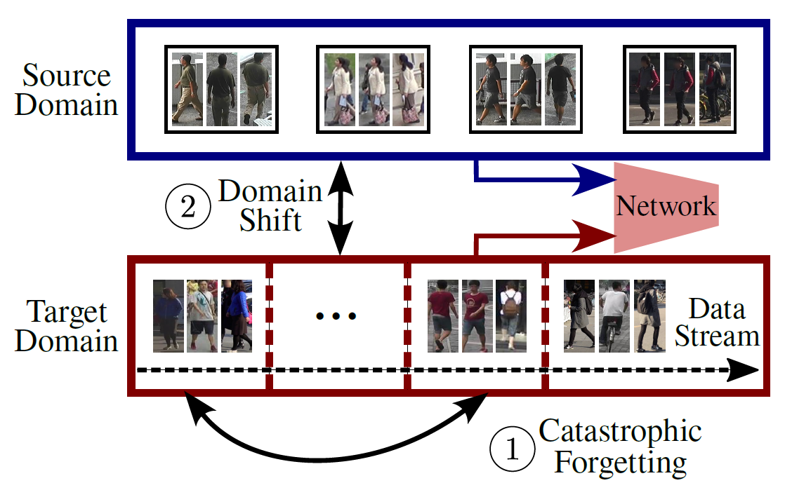
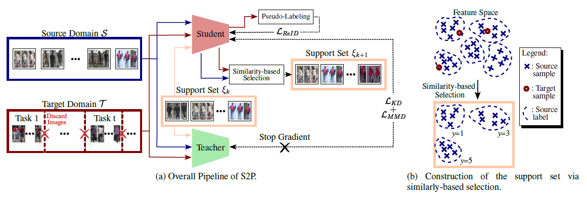

# Source Guided Similarity Preservation (S2P)
This repository contains the code for the paper "Source Guided Similarity Preservation for Unsupervised Domain Adaptation" (WACV 2024).

# [Overview](#contents)

Online Unsupervised Domain Adaptation (OUDA) for person Re-Identification (Re-ID) is the task of continuously adapting a model trained on a well-annotated source domain dataset to a target domain observed as a data stream. In OUDA, person Re-ID models face two main challenges: catastrophic forgetting and domain shift. 

In this work, we propose a new Source-guided Similarity Preservation (S2P) framework to alleviate these two problems. Our framework is based on the extraction of a support set composed of source images that maximizes the similarity with the target data. This support set is used to identify feature similarities that must be preserved during the learning process. S2P can incorporate multiple existing UDA methods to mitigate catastrophic forgetting. 

Our experiments show that S2P outperforms previous state-of-the-art methods on multiple real-to-real and synthetic-to-real challenging OUDA benchmarks.

<p align="center">
    
</p>

For more details, please refer to our [paper](https://openaccess.thecvf.com/content/WACV2024/papers/Rami_Source-Guided_Similarity_Preservation_for_Online_Person_Re-Identification_WACV_2024_paper.pdf).

# [Framework Architecture](#contents)
<p align="center">
    
</p>

# [Updates](#contents)

[25/09/2023] `S2P` v0.1.0 is released.

# [Installation](#contents)

Please refer to [INSTALL.md](OpenUnReID/docs/INSTALL.md) for installation and dataset preparation.

# [Get Started](#contents)
## Training
To train S2P on MSMT17 as source domain and Market1501 as target domain, run the following command:
+ Distributed training in a slurm cluster:
```shell
sbatch S2P_run.sh
```
+ Distributed training locally with multiple GPUs:
```shell
sh run_s2p_train.sh ${RUN_NAME} --epochs 10 --iters 120 --KDloss 0.1 --MMDloss 0.1 
```
## Arguments
+ `RUN_NAME`: the name of the experiment. Logs and checkpoints will be saved in `logs/${RUN_NAME}/`.
+ `--epochs`: the number of training epochs.
+ `--iters`: the number of training iterations.
+ `--KDloss`: the weight of the knowledge distillation loss.
+ `--MMDloss`: the weight of the MMD loss.
+ Refer to run_s2p_train.sh for more arguments. METHOD can be MMT or SpCL.
+ [optional arguments]: please refer to [config.yaml](OpenUnReID/tools/MMT/config.yaml) to modify some key values from the loaded config of the specified method (Support MMT and SpCL).

## Datasets


# [Acknowledgement](#contents)

This repository is built upon [OpenUnReID](https://github.com/open-mmlab/OpenUnReID)